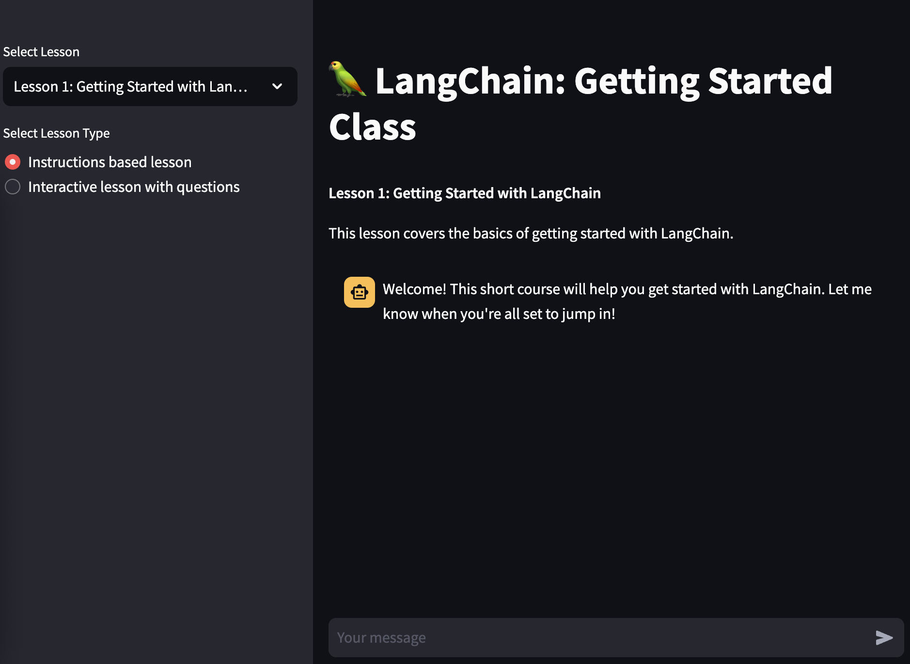

# LangChain-Teacher



## Description

LangChain-Teacher's goal is to facilitate interactive learning of LangChain, enabling users to begin with the Python-based LangChain through a chat-based learning interface. The app offers two teaching styles: Instructional, which provides step-by-step instructions, and Interactive lessons with questions, which prompts users with questions to assess their understanding.

The hosted version of the app is on Streamlit Cloud at [langchain-teacher.streamlit.app](https://langchain-teacher.streamlit.app/)

## How Does This Work?

The core of the teaching process is driven by the prompts defined in `get_prompt.py`. This module creates lessons based on the content available in the `lc_guides` folder, where lessons are stored as `.txt` files. 

   To give a bit more context:

   - The prompt, combined with the lesson content from the `.txt` file, is sent to a Language Learning Model (LLM) to assist in generating bite-sized lessons.
   
   - The chat memory helps LLM retain information about previous instructions and add new ones to the conversation.
   
   - This showcases the power of prompt templates and how prompt engineering could be used in the development of LLM applications.
   

## Getting Started

This Streamlit app guides users through lessons using a chat-based interface. To get started, follow these steps:

### Prerequisites

- Python 3.10 or higher

### Installation

1. Clone the repository from GitHub or create a GitHub Codespace:
   ```
   git clone https://github.com/hwchase17/langchain-teacher.git
   ```
   Change directory to the langchain-teacher directory
   ```
   cd langchain-teacher
   ```

2. Install the required dependencies listed in `requirements.txt`:
   ```
   pip install -r requirements.txt
   ```

3. Create a `.env` file in the root directory and add the following environment variables:

   ```
   OPENAI_API_KEY=
   LANGCHAIN_ENDPOINT=
   LANGCHAIN_API_KEY=
   LANGCHAIN_TRACING_V2=
   LANGCHAIN_PROJECT=
   ```

   An example `.env` file is provided as `.env-example`. If you're not using LangSmith, you only need to set the `OPENAI_API_KEY` variable.

4. Run the Streamlit app using the command:
   ```
   streamlit run lc_main.py
   ```

   If using `dotenv` to manage environment variables, use the following command:
   ```
   dotenv streamlit run lc_main.py
   ```
   
## Additional Files and Branches


- The initial version of the app used a getting started guide at guide.txt together with the main.py file to run the streamlit app. You can also run the initial version of the app using the command:
  ```
   streamlit run main.py
   ```
- There is also a tutor for LangChain expression language with lesson files in the `lcel` folder and the `lcel.py` file to run the streamlit app.

- The `supervisor-model` branch in this repository implements a `SequentialChain` to supervise responses from students and teachers. This approach aims to ensure that questions are on-topic by the students and that the responses are accordingly as well by the teacher model.

## Future Work

- [ ] **Integration with LangSmith Hub**: Integrate prompts directly into the [LangSmith Hub](https://smith.langchain.com/).

- [ ] **Expanding Lesson Library**: Continuously add new lessons to create a comprehensive learning resource.
      
- [ ] **Token Usage Improvement**: Currently the prompt sent to the LLM is quite large as it takes the prompt and the lesson. Could be improved further.


## Contributions

Please feel free to add more lessons/examples/use cases. We would love for langchain-teacher to be the first stop for any new learner. You can contribute by creating pull requests or raising issues.

## License

This project is licensed under the [MIT License](LICENSE).


